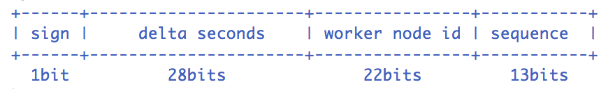

## UIDGenerator

分布式主键生成的一个 `nodejs` 实现方案。参考 [baidu/uid-generator](https://github.com/baidu/uid-generator)

## Snowflake


## install
```bash
npm install uid-generatorjs
```

## Usage
```javascript
const { createUIDGenerator } = require('uid-generatorjs');

async function main() {
    createUIDGenerator({
        timeBits: 31,       // 时间位数
        workerBits: 23,     // 工作节点编号
        seqBits: 9,         // 序列号位数
        epoch: new Date('2021-02-05'),  // 时间的起始
        store: {
            type: 'mysql',
            host: '127.0.0.1',
            port: 3306,
            databse: 'uid_generatorjs',
        },
    }).then(uidGenerator => {
        // Generate UID
        const uid = uidGenerator.createUID();

        // Parse UID into [Timestamp, WorkerId, Sequence]
        console.log(uidGenerator.parseUID(uid));
    });
}
```
